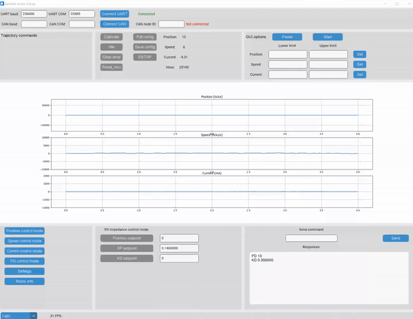

# Spectral-motor-GUI

  

https://source-robotics.com

This Repo contains Software for [Spectral Micro BLDC controller](https://github.com/PCrnjak/Spectral-Micro-BLDC-controller)

# How to install 

Tested on python 3.10.12  

**Using requirements.txt** 
TODO pip install -r requirements.txt 

**Using .exe **   
[x64 Windows version](https://github.com/PCrnjak/Spectral-motor-GUI/releases)  
Linux version  TODO   

# Documentation / How to use:

How to use Spectral motor GUI can be found in [DOCS](https://source-robotics.github.io/Spectral-BLDC-docs/)  
The video guide can be found [here!]()

# More about Spectral motors
- [Discord](https://discord.com/invite/prjUvjmGpZ )
- [Forum](https://discourse.source-robotics.com/)
- [Blog](https://source-robotics.com/blogs/blog)
- [Youtube](https://www.youtube.com/channel/UCp3sDRwVkbm7b2M-2qwf5aQ)
- [Hackaday](https://hackaday.io/project/191860-parol6-desktop-robotic-arm)
- [Instagram](https://www.instagram.com/source_robotics/)
- [DOCS](https://source-robotics.github.io/Spectral-BLDC-docs/apage1_specs/)
- [Twitter](https://twitter.com/SourceRobotics)

# TODO

- Connect over CAN bus
- Trajectories

# 📢📢Contributing to the project 📢📢
Some features are still missing on the software and hardware side of the Spectral BLDC and GUI.
If you want to contribute you can open issues or pull requests in the GitHub repo to implement a feature! (Use DEV branch)
You can request or say you are working on a feature in the "general" channel of our [Discord]( https://discord.gg/prjUvjmGpZ) or [blog](https://discourse.source-robotics.com/)

# Support
This project is entirely open-source and free for all to use. Any support, whether through donations or advice, is greatly appreciated. Thank you!

 

# Project is under MIT Licence

